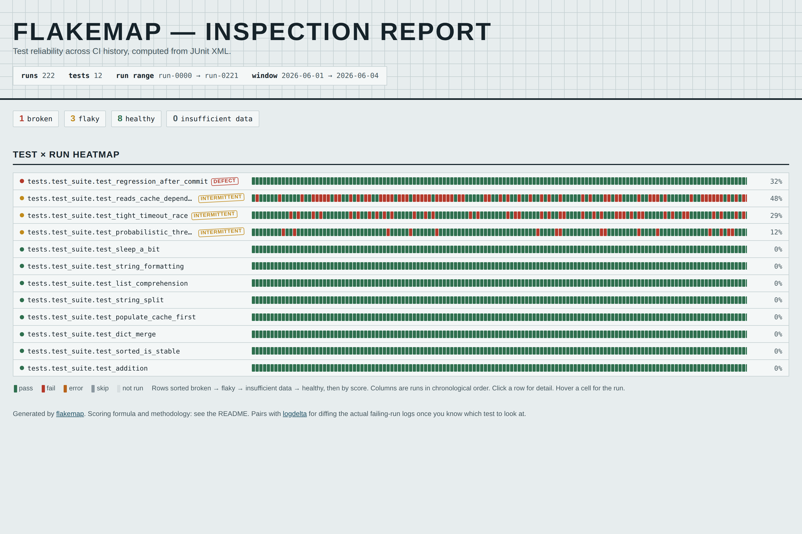
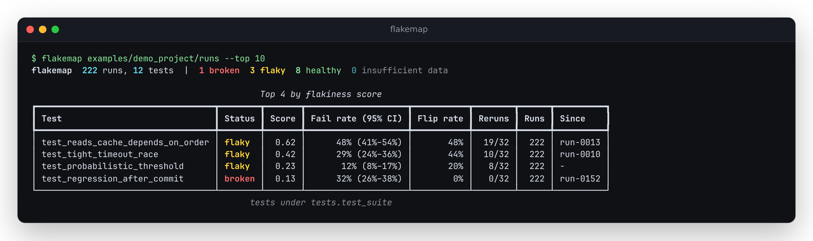

# flakemap

**Find the flaky tests in your CI history. Drop in JUnit XML from past runs, get a
ranked, statistically honest flake report.**

[](LICENSE)
[](https://antonsoo.github.io/flakemap/)

Every CI system already writes JUnit XML on every run. That history has the answer
to which tests are flaky, how badly, since when, and whether a failure correlates
with a runner, a time of day, or a slow run -- but almost nobody looks, because the
data is scattered across hundreds of build artifacts and nobody wants to eyeball
them. Engineers re-run until green instead, and every re-run trains the team a
little further to stop reading failures. `flakemap` reads a directory of JUnit
reports from many runs and produces a ranked flake report: which tests are
actually nondeterministic (not just occasionally broken), how confident that
claim is given the sample size, and when it started. It runs locally, reads XML
you already have, and has no SaaS dependency. It pairs with the same author's
[`logdelta`](https://github.com/antonsoo/logdelta) (diff logs from a failing CI
run against known-good baselines) once you know *which* test to look at.

<p align="center"></p>

## Quickstart

```console
$ git clone https://github.com/antonsoo/flakemap && cd flakemap
$ uv sync
$ uv run flakemap examples/demo_project/runs
```

That last command analyzes the ~220 real `pytest` runs committed in this repo
(see [Honest real demo data](#honest-real-demo-data)) and prints the terminal
report below -- no setup, no fixtures to write yourself. Prebuilt packages
aren't published yet, so install from source or straight from GitHub:
`pip install git+https://github.com/antonsoo/flakemap`.

## Features

- **Dialect-tolerant JUnit XML parsing**: pytest, Jest (jest-junit), and
  Maven/Gradle Surefire verified against real tool output; go-junit-report
  supported against its documented format. Malformed and truncated files
  degrade to a warning, never a crash. Details and sources:
  [`docs/formats.md`](docs/formats.md).
- **Run metadata** (commit, branch, timestamp, runner, OS) from a sidecar
  JSON, a directory-per-run layout, or file mtime as a last resort.
- **Per-test statistics**: Wilson-interval failure rate, flip rate,
  same-commit rerun disagreement (the "failed then passed on identical code"
  signal), a documented flakiness score, single change-point detection,
  duration trend, duration-vs-failure correlation, and per-runner/per-OS
  failure rate breakdowns.
- **Classification**: `broken` (consistently failing since a commit) vs.
  `flaky` (intermittent) vs. `healthy` vs. `insufficient_data`, plus grouping
  by suite/module.
- **Outputs**: a rich terminal report, `--json`, `--markdown` for PR comments,
  and a self-contained `--html` report with a test x run heatmap, per-test
  detail, and failure-message clustering.
- **`--fail-on-new-flake`** for CI gating: exit 1 if a test's change-point
  falls inside a trailing window and it's classified flaky or broken.

## Usage

```console
$ flakemap examples/demo_project/runs --top 10
```

<p align="center"></p>

```console
$ flakemap examples/demo_project/runs --json | jq '.tests[0]'
$ flakemap examples/demo_project/runs --markdown > flake-report.md   # for a PR comment
$ flakemap examples/demo_project/runs --html report.html            # self-contained, open in a browser
$ flakemap examples/demo_project/runs --fail-on-new-flake; echo "exit: $?"
```

Click any row in the HTML report to expand its full statistics (see
[`docs/assets/heatmap-detail.png`](docs/assets/heatmap-detail.png) for a
worked example); hover a cell for that run's id, commit, duration, and failure
message. It respects `prefers-color-scheme` for dark mode and has zero
external requests -- open it from a CI artifact zip with no network.

## How it works

Full formulas and citations are in the module docstrings
(`src/flakemap/stats/`); this is the summary.

- **Failure rate**: `fails / (pass + fail + error)` (skips excluded from the
  denominator), reported with a **Wilson score interval**
  (Wilson, E.B., 1927, *"Probable Inference, the Law of Succession, and
  Statistical Inference,"* JASA 22(158):209-212) rather than a plain Wald
  interval, because Wald intervals can extend past [0, 1] and have poor
  coverage exactly where most tests live: small samples, rates near 0 or 1.
- **Flip rate**: the fraction of consecutive run pairs where a test's outcome
  changed (pass -> fail or fail -> pass).
- **Same-commit rerun disagreement**: among commits with 2+ runs, the
  fraction where the test both passed and failed on *identical code* -- the
  textbook definition of flaky when your CI reruns on failure (cf. Lam et al.,
  *"iDFlakies: A Framework for Detecting and Partially Classifying Flaky
  Tests,"* ICST 2019, which uses repeated execution on a fixed revision as the
  ground-truth signal for flakiness).
- **Flakiness score** (0-1, a heuristic, not a literature standard):
  `confidence * (0.4 * flip_rate + 0.4 * rerun_signal + 0.2 * intermittency)`,
  where `intermittency = 2 * min(p, 1-p)` (0 when always-pass or always-fail,
  1 at p=0.5) and `confidence = min(1, n/20)` shrinks the score for
  small samples so a test seen twice can't outrank one seen 200 times.
- **Change point**: a single-change-point likelihood-ratio detector for a
  Bernoulli sequence (see Chen, J. & Gupta, A.K., *Parametric Statistical
  Change Point Analysis*, 2nd ed., Birkhauser, 2012, ch. 3) -- the split that
  best explains the run history as two constant-rate segments instead of one,
  subject to a minimum segment length (3) and minimum rate shift (0.2) so it
  doesn't fire on a single stray failure. **Known limitation**: it is not
  corrected for multiple comparisons (every split is scanned), so a
  persistently flaky test can show a spurious change point; trust it most
  when the classification is `broken`, where the before/after effect size is
  unambiguous (see [Accuracy and limitations](#accuracy-and-limitations)).
- **Duration signals**: an OLS trend (seconds per run) and the
  **point-biserial correlation** between duration and outcome (Tate, R.F.,
  1954, *"Correlation Between a Discrete and a Continuous Variable,"* Annals
  of Mathematical Statistics 25(3):603-607) -- the signature of a
  timeout-driven flake is a positive correlation (failures ran longer).
- **Runner/OS correlation**: per-category Wilson intervals rather than a
  chi-square p-value. With the handful of runners and modest per-category
  sample sizes typical of a CI matrix, a hypothesis test would overstate
  precision; a report should show the spread and let a non-overlapping
  interval speak for itself.
- **Classification** (`src/flakemap/stats/analyze.py::_classify`): fewer than
  5 observations -> `insufficient_data`. Zero failures and zero flips ->
  `healthy`. Flip rate > 8% or any rerun disagreement -> `flaky`. A change
  point with a post-change failure rate >= 75%, or an overall failure rate >=
  60% -> `broken`. Any remaining failures -> `flaky`. These thresholds are
  documented, not tuned against a labeled corpus beyond the synthetic one
  below -- treat them as a reasonable default, not a calibrated model.

## Honest real demo data

`examples/demo_project/` is a small synthetic `pytest` suite
(`tests/test_suite.py`) with **planted, documented** failure patterns: a
timing race against a tight budget, `random()`-driven flakiness, a
shared-mutable-state test that's order-dependent under `pytest-randomly`, a
handful of always-passing tests, and one test that reliably regresses from a
specific simulated commit onward (`BUG_INTRODUCED_AT = 130`).
`generate_demo_data.py` runs that real suite 222 times (190 simulated commits,
32 with a same-commit rerun) with `pytest-randomly` reshuffling test order and
reseeding `random` every run, tags roughly a quarter of runs as a slower
`macos-latest` runner (a scripted constant delay added to real, measured
sleeps -- see the script's docstring), and writes each run's real
`pytest --junitxml` output plus a `meta.json` sidecar. The committed
`examples/demo_project/runs/` (~2.7 MB across 222 run directories, every file
well under 1 MB) is that exact output; regenerate it yourself with
`uv run python examples/demo_project/generate_demo_data.py`.

Nothing about the *outcomes* is scripted -- every pass/fail in the XML is a
real `pytest` result. Running `flakemap` on that corpus recovers the planted
ground truth:

| Test | Planted as | flakemap says |
|---|---|---|
| `test_regression_after_commit` | breaks forever at commit 130 | **broken**, change point at commit `00082aaaaaaa` (hex `82` = 130) -- exact match |
| `test_reads_cache_depends_on_order` | order-dependent (~coin flip under shuffling) | **flaky**, 47.8% failure rate, 48.0% flip rate |
| `test_tight_timeout_race` | timing race, `macos-latest` slower | **flaky**, 29.3% overall; 51.1% on `macos-latest` vs. 23.4% on `ubuntu-latest` (non-overlapping 95% CIs); duration-failure correlation +0.79 |
| `test_probabilistic_threshold` | `random() >= 0.12`, i.e. ~12% | **flaky**, 11.7% measured (Wilson 95% CI 8.1-16.6%, contains the planted 12%) |
| 8 deterministic tests | always pass | **healthy**, 0% failure rate on all 8 |

Reproduce this table: `uv run flakemap examples/demo_project/runs --json`.

## Accuracy and limitations

- **Change-point false positives on IID-flaky tests.** As noted above, the
  detector isn't multiple-comparisons-corrected; on a long history of a
  constant-but-nonzero failure rate it can report a change point that isn't
  real. It doesn't affect the `broken`/`flaky` classification (which needs a
  high post-change rate to call something broken), only the "since" run shown
  for flaky tests -- read that as informational, not causal.
- **go-junit-report and Surefire fixtures are hand-authored**, not generated
  by running Go/Maven/Gradle locally (unavailable in the build environment).
  They match the documented output shape; see
  [`docs/formats.md`](docs/formats.md) for exactly what was and wasn't
  verified against real tool output.
- **.NET (trx) is not supported.** It's a different XML schema, not a JUnit
  dialect; feeding it to flakemap yields a parse warning and no testcases,
  not a crash, but there's no MSTest support here.
- **mtime-ordered runs are only as reliable as the filesystem.** A fresh
  `git clone` or artifact re-download can collapse many files to nearly the
  same mtime; flakemap warns when more than half a batch falls back to mtime,
  but a sidecar or directory-per-run layout is strongly preferred (see
  [`docs/formats.md`](docs/formats.md)).
- **Message clustering is a digit-normalization heuristic**
  (`\d+` -> `#`), not semantic diffing -- it merges "timed out after 4123ms"
  variants but won't merge two differently-worded messages for the same root
  cause. That's closer to what [`logdelta`](https://github.com/antonsoo/logdelta)
  does on the actual log content once you know which run to inspect.
- **The flakiness score and classification thresholds are a documented
  heuristic**, not fit against a labeled real-world corpus beyond the
  synthetic demo above. They're a reasonable default starting point for
  ranking, not a calibrated flakiness probability.
- **This is an offline batch tool.** It doesn't talk to any CI provider's
  API; you still need a step that collects JUnit XML as artifacts (see the CI
  recipe below).

## CI recipe (example)

A weekly job that pulls the last N runs' JUnit XML artifacts and gates on new
flakes. Adjust the artifact-collection step to your CI provider; this is
GitHub Actions collecting `pytest --junitxml` output into a rolling directory
of run artifacts, then running flakemap against it:

```yaml
# .github/workflows/flakemap-weekly.yml (example -- adapt to your own artifact storage)
name: flakemap weekly
on:
  schedule:
    - cron: "0 6 * * 1"
  workflow_dispatch:
jobs:
  flake-report:
    runs-on: ubuntu-latest
    steps:
      - uses: actions/checkout@v7
      - uses: astral-sh/setup-uv@v10
        with: { python-version: "3.12" }
      # download-artifact (or your artifact store) into ci-runs/<run_id>/report.xml
      # each with a meta.json sidecar -- see docs/formats.md's convention.
      - run: uv run --with flakemap flakemap ci-runs/ --markdown >> "$GITHUB_STEP_SUMMARY"
      - run: uv run --with flakemap flakemap ci-runs/ --fail-on-new-flake
```

## Contributing

See [`CONTRIBUTING.md`](CONTRIBUTING.md). Tests, lint (`ruff`), format
(`ruff format`), and typecheck (`mypy --strict`) all run via `uv run`; no
network access is needed beyond `uv sync`.

## License

[MIT](LICENSE) (c) 2026 Anton Soloviev.

---

<sub>Part of [Officina](https://antonsoo.github.io/officina/), a set of small open-source tools by [Anton Soloviev](https://github.com/antonsoo).</sub>
