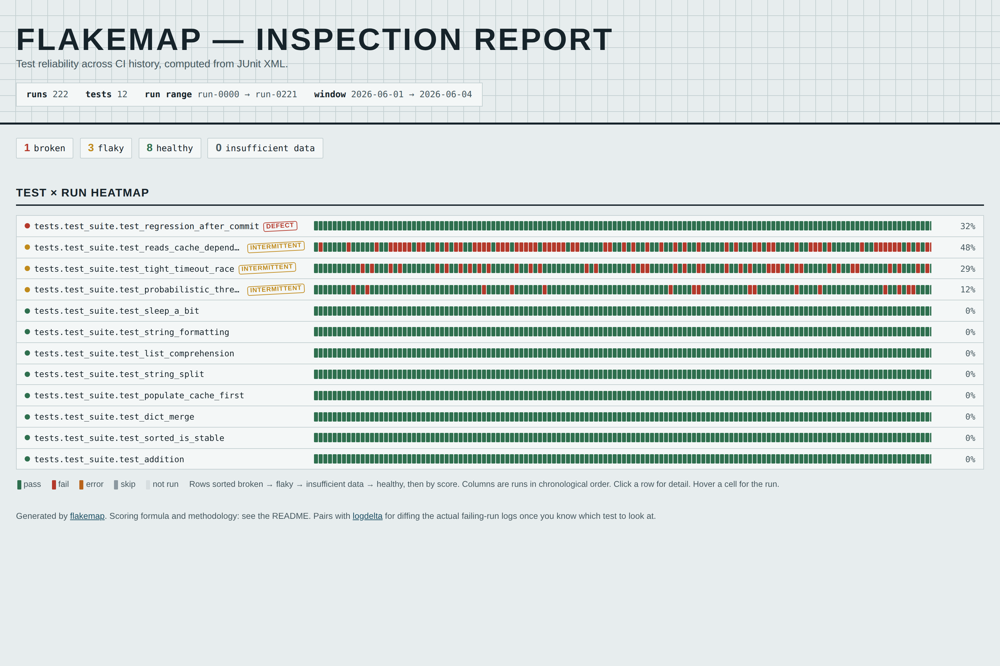
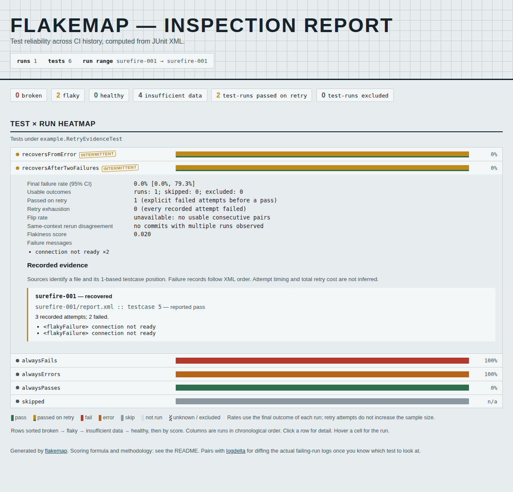
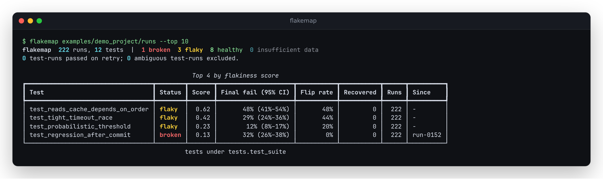

# flakemap

**Find the failures that green retries hide. Inspect JUnit history locally, down
to the failed attempts and source records.**

[](LICENSE)
[](https://antonsoo.github.io/flakemap/)
[](https://huggingface.co/spaces/antonsoloviev/flakemap)

CI can turn green after a test fails twice and passes on its third attempt.
Surefire preserves those failures as `<flakyFailure>` records, but a reader that
only looks for `<failure>` sees an ordinary pass. Flakemap keeps the failed
attempts, distinguishes retry recovery from final failure rate, and lets you
inspect the source file and testcase behind each finding.

Give it one report to inspect retries, or a history of reports to rank intermittent
failures, compare runners, and look for regressions. Duplicate identifiers and
conflicting shard metadata stay visibly excluded instead of becoming extra
statistical samples. Reports are local, self-contained files, with no CI-provider
account or service required. It pairs with the same author's
[`logdelta`](https://github.com/antonsoo/logdelta) (diff logs from a failing CI
run against known-good baselines) once you know *which* test to look at.

<p align="center"></p>

## What a green result can hide

```bash
uv run flakemap examples/retry_history --html retry-report.html
uv run flakemap examples/retry_history --json --fail-on-retry > retry-report.json
```

The second command writes valid JSON and exits **1**: two tests in this fixture
passed only after failures. The fixture was produced by **Maven Surefire 3.5.4**
running the [included Java tests](examples/retry_project/README.md), with controlled
failures. It is not evidence about a production project's reliability.

| Test | Reporter evidence | Final outcome | Counted toward rate |
|---|---|---|---|
| `recoversAfterTwoFailures` | 2 failed attempts, then a pass | pass, flagged flaky | 1 run |
| `recoversFromError` | 1 error, then a pass | pass, flagged flaky | 1 run |
| `alwaysFails` | failure plus 2 failed retries | fail | 1 run |
| `alwaysErrors` | error plus 2 errored retries | error | 1 run |

The XML's suite counter says **13 tests**; there are **6 testcases**, including
an ordinary pass and a skip. Attempt totals do not become sample sizes. One
reported recovery is direct evidence of a passed-on-retry result, but one run
cannot estimate its long-term frequency precisely. The exhausted cases therefore
remain `insufficient_data`, rather than being labeled permanently broken.



Retry inspection is in the CLI and in every generated HTML report. The hosted
demo's pytest history contains no retries, so the retry view shows up only in
reports built from retry data, like the commands above.

## Quickstart

```console
$ git clone https://github.com/antonsoo/flakemap && cd flakemap
$ uv sync
$ uv run flakemap examples/demo_project/runs
```

That last command analyzes the ~220 real `pytest` runs committed in this repo
(see [Honest real demo data](#honest-real-demo-data)) and prints the terminal
report below -- no setup, no fixtures to write yourself. Prebuilt packages
aren't published yet, so install from source or straight from GitHub:
`pip install git+https://github.com/antonsoo/flakemap`.

## Features

- **JUnit XML parsing**: pytest, Jest (jest-junit), and Maven Surefire checked
  against real tool output; Gradle merged retries and go-junit-report supported
  against their documented formats. Malformed and truncated files
  degrade to a warning, never a crash. Details and sources:
  [`docs/formats.md`](docs/formats.md).
- **Retry evidence**: explicit recovered and exhausted attempts, source file and
  testcase positions, failure messages, and a separate recovered-run count.
  Retries never inflate the per-run failure-rate denominator.
- **Input integrity**: duplicate test identifiers and inconsistent run metadata
  are excluded with inspectable records. Warnings survive JSON, Markdown, and
  HTML export. `--fail-on-incomplete` makes these omissions fail a CI check.
- **Run metadata** (commit, branch, timestamp, runner, OS) from a sidecar
  JSON, a directory-per-run layout, or file mtime as a last resort.
- **Per-test statistics**: Wilson-interval failure rate, flip rate,
  same-commit rerun disagreement (the "failed then passed on identical code"
  signal), a documented flakiness score, single change-point detection,
  duration trend, duration-vs-failure correlation, and per-runner/per-OS
  failure rate breakdowns.
- **Classification**: `broken` (consistently failing since a commit) vs.
  `flaky` (intermittent) vs. `healthy` vs. `insufficient_data`, plus grouping
  by suite/module.
- **Outputs**: a rich terminal report, `--json`, `--markdown` for PR comments,
  and a self-contained `--html` report with a test x run heatmap, per-test
  detail, and failure-message clustering.
- **`--fail-on-new-flake`** for CI gating: exit 1 if a test's change-point
  falls inside a trailing window and it's classified flaky or broken.
- **`--fail-on-retry`** exits 1 for any explicitly recovered test in the supplied
  history, including a single run. Pass only the current run when gating a build.

## Usage

```console
$ flakemap examples/demo_project/runs --top 10
```

<p align="center"></p>

```console
$ flakemap examples/demo_project/runs --json | jq '.tests[0]'
$ flakemap examples/demo_project/runs --markdown > flake-report.md   # for a PR comment
$ flakemap examples/demo_project/runs --html report.html            # self-contained, open in a browser
$ flakemap examples/demo_project/runs --fail-on-new-flake; echo "exit: $?"
```

Click any row in the HTML report to expand its full statistics (see
[`docs/assets/heatmap-detail.png`](docs/assets/heatmap-detail.png) for a
worked example); hover a cell for that run's id, commit, duration, and failure
message. It respects `prefers-color-scheme` for dark mode and has zero
external requests -- open it from a CI artifact zip with no network.

## How it works

Full formulas and citations are in the module docstrings
(`src/flakemap/stats/`); this is the summary.

- **Final failure rate**: `fails / (pass + fail + error)`, one outcome per test
  per run. Skips, ambiguous duplicates, and contradictory outcomes are excluded.
  A passed-on-retry test remains a final pass, with its recovery counted separately.
  The rate is reported with a **Wilson score interval**
  (Wilson, E.B., 1927, *"Probable Inference, the Law of Succession, and
  Statistical Inference,"* JASA 22(158):209-212) rather than a plain Wald
  interval, because Wald intervals can extend past [0, 1] and have poor
  coverage exactly where most tests live: small samples, rates near 0 or 1.
- **Flip rate**: the fraction of consecutive observed, non-skipped outcome pairs
  that changed (pass -> fail or fail -> pass). Unknown outcomes break pairs;
  absent tests and skips are not observations. `flip_pairs` gives the denominator.
- **Same-context rerun disagreement**: group by commit, branch, runner and OS;
  among groups with 2+ runs, report the fraction with both a pass and a failure.
  This avoids treating a Linux pass and a Windows failure as a rerun on the same
  environment. Unrecorded configuration can still differ (cf. Lam et al.,
  *"iDFlakies: A Framework for Detecting and Partially Classifying Flaky
  Tests,"* ICST 2019, which uses repeated execution on a fixed revision as the
  ground-truth signal for flakiness).
- **Flakiness score** (0-1, a heuristic, not a literature standard):
  `confidence * (0.4 * flip_rate + 0.4 * max(rerun_signal, recovered_runs/n) + 0.2 * intermittency)`,
  where `intermittency = 2 * min(p, 1-p)` (0 when always-pass or always-fail,
  1 at p=0.5) and `confidence = min(1, n/20)` shrinks the score for
  small samples to reduce their influence on the ranking.
  Recovery is based only on explicit retry markers; its observed frequency is
  not an estimate of unreported retries. No retry markers means no change to
  the previous score formula.
- **Change point**: a single-change-point likelihood-ratio detector for a
  Bernoulli sequence (see Chen, J. & Gupta, A.K., *Parametric Statistical
  Change Point Analysis*, 2nd ed., Birkhauser, 2012, ch. 3) -- the split that
  best explains the run history as two constant-rate segments instead of one,
  subject to a minimum segment length (3), a minimum rate shift (0.2), and a
  significance threshold on the likelihood-ratio statistic (13.8). Scanning
  every split always finds a best one, even in a test that has failed at the
  same rate all along; the threshold is the statistic's approximate 99th
  percentile under no change, from simulation over 50-1000 runs and 5-50%
  failure rates (`scripts/changepoint_null.py` prints the table). A steadily
  flaky test now reports a change about 1% of the time, where before the
  threshold it was up to half the time, and one in its last 10 runs 12-16% of
  the time (the window `--fail-on-new-flake` gates on). The price is
  sensitivity to small, recent shifts: a test going from 0% to 20% failures
  in its last 10 runs is caught about half the time. The selected split is
  not proof of the cause or onset.
- **Duration signals**: an OLS trend (seconds per run) and the
  **point-biserial correlation** between duration and outcome (Tate, R.F.,
  1954, *"Correlation Between a Discrete and a Continuous Variable,"* Annals
  of Mathematical Statistics 25(3):603-607) -- the signature of a
  timeout-driven flake is a positive correlation (failures ran longer).
  Retry-bearing records are excluded: Surefire's `time` describes a single
  attempt, not the retry cost. Missing/invalid durations stay unknown; trend is
  per usable duration observation, which may skip runs.
- **Runner/OS correlation**: per-category Wilson intervals rather than a
  chi-square p-value. With the handful of runners and modest per-category
  sample sizes typical of a CI matrix, a hypothesis test would overstate
  precision; a report should show the spread and let a non-overlapping
  interval speak for itself.
- **Classification**: an explicit recovered retry is labeled `flaky`, even from
  one run. Otherwise (`src/flakemap/stats/analyze.py::_classify`), fewer than
  5 observations -> `insufficient_data`. Zero failures and zero flips ->
  `healthy`. Flip rate > 8% or any rerun disagreement -> `flaky`. A change
  point with a post-change failure rate >= 75%, or an overall failure rate >=
  60% -> `broken`. Any remaining failures -> `flaky`. These thresholds are
  documented, not tuned against a labeled corpus beyond the synthetic one
  below -- treat them as a reasonable default, not a calibrated model.
  Excluded outcomes prevent a `healthy` label and suppress change-point inference
  for that test. The confidence interval measures final-failure frequency, not
  confidence in the classification or a claim about the cause.

## Honest real demo data

`examples/demo_project/` is a small synthetic `pytest` suite
(`tests/test_suite.py`) with **planted, documented** failure patterns: a
timing race against a tight budget, `random()`-driven flakiness, a
shared-mutable-state test that's order-dependent under `pytest-randomly`, a
handful of always-passing tests, and one test that reliably regresses from a
specific simulated commit onward (`BUG_INTRODUCED_AT = 130`).
`generate_demo_data.py` runs that real suite 222 times (190 simulated commits,
32 with a same-commit rerun) with `pytest-randomly` reshuffling test order and
reseeding `random` every run, tags roughly a quarter of runs as a slower
`macos-latest` runner (a scripted constant delay added to real, measured
sleeps -- see the script's docstring), and writes each run's real
`pytest --junitxml` output plus a `meta.json` sidecar. The committed
`examples/demo_project/runs/` (~2.7 MB across 222 run directories, every file
well under 1 MB) is that exact output; regenerate it yourself with
`uv run python examples/demo_project/generate_demo_data.py`.

Nothing about the *outcomes* is scripted -- every pass/fail in the XML is a
real `pytest` result. Running `flakemap` on that corpus recovers the planted
ground truth:

| Test | Planted as | flakemap says |
|---|---|---|
| `test_regression_after_commit` | breaks forever at commit 130 | **broken**, change point at commit `00082aaaaaaa` (hex `82` = 130) -- exact match |
| `test_reads_cache_depends_on_order` | order-dependent (~coin flip under shuffling) | **flaky**, 47.8% failure rate, 48.0% flip rate |
| `test_tight_timeout_race` | timing race, `macos-latest` slower | **flaky**, 29.3% overall; 51.1% on `macos-latest` vs. 23.4% on `ubuntu-latest` (non-overlapping 95% CIs); duration-failure correlation +0.79 |
| `test_probabilistic_threshold` | `random() >= 0.12`, i.e. ~12% | **flaky**, 11.7% measured (Wilson 95% CI 8.1-16.6%, contains the planted 12%) |
| 8 deterministic tests | always pass | **healthy**, 0% failure rate on all 8 |

Reproduce this table: `uv run flakemap examples/demo_project/runs --json`.

## Accuracy and limitations

- **Change points are calibrated approximately, not exactly.** The
  significance threshold is one fixed value from simulation, so the
  false-positive rate on a constant-rate test varies from about 0% to 2% with
  history length and failure rate, and short histories are held to a stricter
  standard than they need. Both the "since" run and the classification are
  triage hints, not causal conclusions.
- **Format coverage is explicit.** The original basic Go/Surefire fixtures were
  hand-authored. Retry support now also has real Surefire output; Gradle's merged
  retry convention is checked against documentation, not a local Gradle run. See
  [`docs/formats.md`](docs/formats.md) for exactly what was and wasn't
  verified against real tool output.
- **Unmerged retries are ambiguous.** Repeated `<testcase>` identifiers can also
  mean parameter collisions or copied artifacts. Flakemap excludes them instead
  of assuming order or counting them as independent runs. For Gradle, enable
  `mergeReruns`; for CI job reruns or matrix variants, supply distinct `run_id`s.
- **Reports can omit retry history.** A clean-looking record proves only that
  no supported retry markers were present. No attempt times or causal diagnosis
  are reconstructed. Failure messages are limited to their first 500-character
  line; source pointers refer to testcase ordinals, not line numbers.
- **.NET (trx) is not supported.** It's a different XML schema, not a JUnit
  dialect; feeding it to flakemap yields a parse warning and no testcases,
  not a crash, but there's no MSTest support here.
- **mtime-ordered runs are only as reliable as the filesystem.** A fresh
  `git clone` or artifact re-download can collapse many files to nearly the
  same mtime; flakemap warns when more than half a batch falls back to mtime,
  but a sidecar or directory-per-run layout is strongly preferred (see
  [`docs/formats.md`](docs/formats.md)).
- **Message clustering is a digit-normalization heuristic**
  (`\d+` -> `#`), not semantic diffing -- it merges "timed out after 4123ms"
  variants but won't merge two differently-worded messages for the same root
  cause. That's closer to what [`logdelta`](https://github.com/antonsoo/logdelta)
  does on the actual log content once you know which run to inspect.
- **The flakiness score and classification thresholds are a documented
  heuristic**, not fit against a labeled real-world corpus beyond the
  synthetic demo above. They're a reasonable default starting point for
  ranking, not a calibrated flakiness probability.
- **This is an offline batch tool.** It doesn't talk to any CI provider's
  API; you still need a step that collects JUnit XML as artifacts (see the CI
  recipe below).

## CI recipe (example)

A weekly job that pulls the last N runs' JUnit XML artifacts and gates on new
flakes. Adjust the artifact-collection step to your CI provider; this is
GitHub Actions collecting `pytest --junitxml` output into a rolling directory
of run artifacts, then running flakemap against it:

```yaml
# .github/workflows/flakemap-weekly.yml (example -- adapt to your own artifact storage)
name: flakemap weekly
on:
  schedule:
    - cron: "0 6 * * 1"
  workflow_dispatch:
jobs:
  flake-report:
    runs-on: ubuntu-latest
    steps:
      - uses: actions/checkout@v7
      - uses: astral-sh/setup-uv@v10
        with: { python-version: "3.12" }
      # download-artifact (or your artifact store) into ci-runs/<run_id>/report.xml
      # each with a meta.json sidecar -- see docs/formats.md's convention.
      - run: uv run --with 'git+https://github.com/antonsoo/flakemap' flakemap ci-runs/ --markdown >> "$GITHUB_STEP_SUMMARY"
      - run: uv run --with 'git+https://github.com/antonsoo/flakemap' flakemap ci-runs/ --fail-on-new-flake --fail-on-incomplete
```

Use `--fail-on-retry` on a current-run artifact to gate on observed retry recovery.
Exit codes: **0** report completed with no requested gate hit; **1** a requested
flake/retry gate hit; **2** an input/output error, no usable outcomes, or an
incomplete report with `--fail-on-incomplete`. Code 2 takes precedence. Diagnostics
go to stderr, so `--json --html report.html --fail-on-retry` still emits one valid
JSON document on stdout. [JSON schema version 2](docs/formats.md#json-output-version-2)
includes retry and excluded-record evidence.

## Contributing

See [`CONTRIBUTING.md`](CONTRIBUTING.md). Tests, lint (`ruff`), format
(`ruff format`), and typecheck (`mypy --strict`) all run via `uv run`; no
network access is needed beyond `uv sync`.

## License

[MIT](LICENSE) (c) 2026 Anton Soloviev.

---

<sub>Part of [Officina](https://antonsoo.github.io/officina/), a set of small open-source tools by [Anton Soloviev](https://github.com/antonsoo).</sub>
